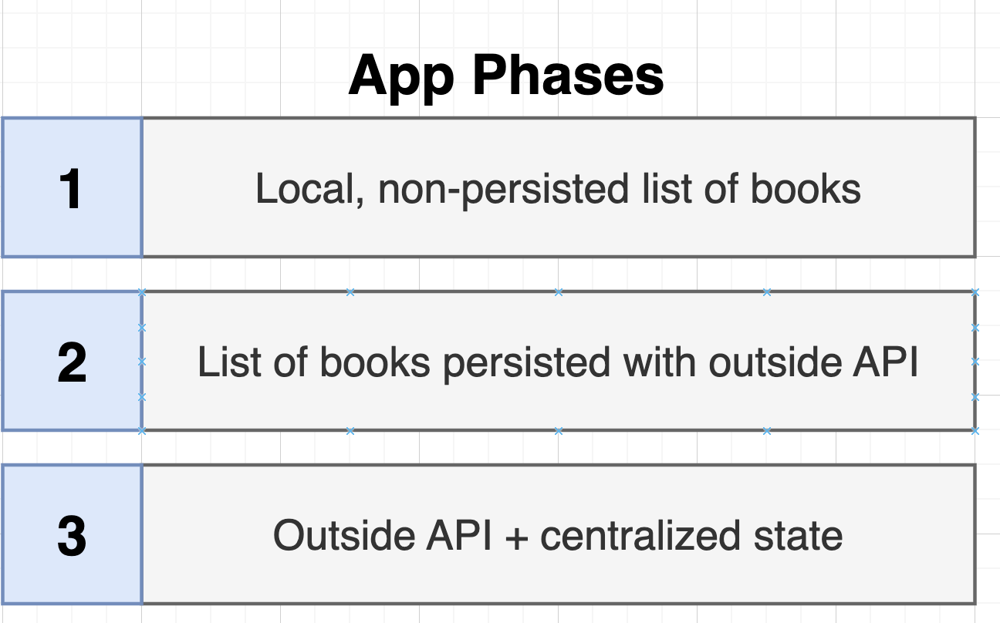
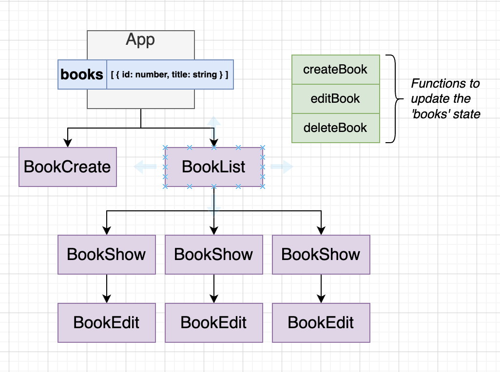
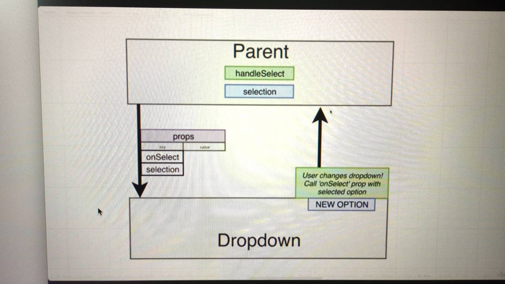
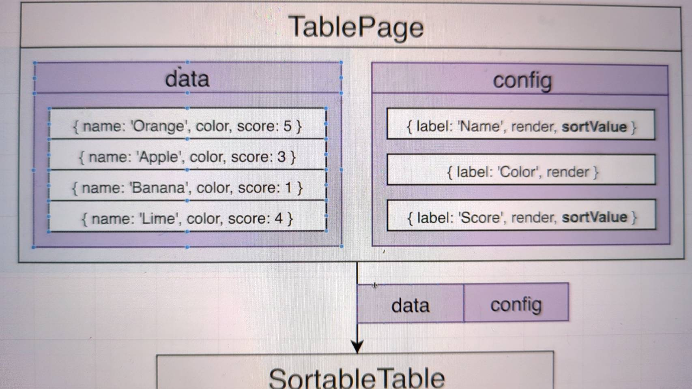
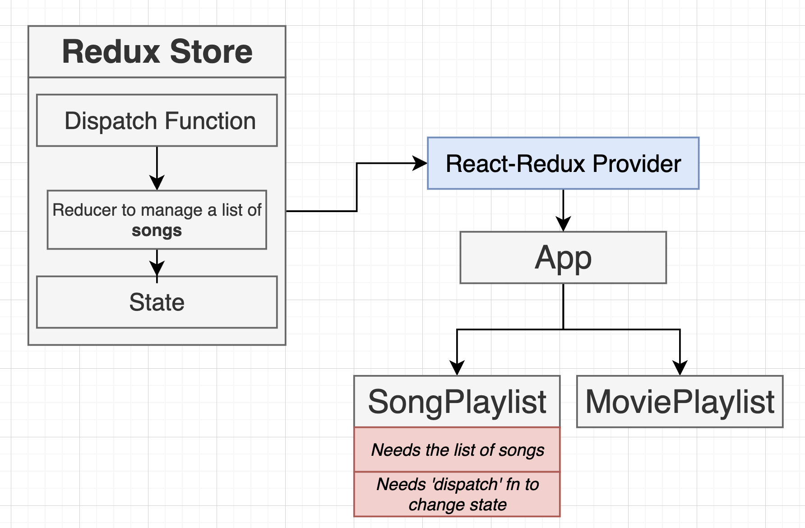

# Converting html to JSX

1. All prop names follow camelCase
2. Number attributes use curly braces
3. Boolean 'true' can be written with property name, 'false' should be written with curly braces
4. the 'class' attribute is written as 'className'
5. in-line styles are provided as object
6. JSX cheat sheet https://jsx-notes.vercel.app/#Element%20Tags

   

# import export module system

1. export (分成ㄌ default(只能一個), named(多個))
   
2. import default 可以 rename, 但 import named 不可以 rename 且需要加上 {}
   
3. others
   

# Animals project

## Event System

    1. React有哪些 Event: https://legacy.reactjs.org/docs/events.html
    2. 不要在 callback function 加(), 不然會馬上執行

## State System

1.  
2.  更新 state 的時候 => rerender including all children components

# Pics project

## components


## await and async

await 和 async 通常同時出現


## how child communicate to parents

1. parent -> child 
2. child -> parent? 
   - answer: use callback func as prop and callBack can receive child variable 

## how to handle input/checkbox/radioButton... value

Do not use querySelector....

- use 
- use state to display 

## key usage

1. 當 render list of component, 請使用 unique key
2. key 讓 rerender 時候只會針對有變動的 component 做 render, 減少系統負擔
   

# Books projects(此 Project App 有三種 refactor 變形)



# 1. 第一種: Local, non-persisted list of books


## Components


## 如何判斷 state 要定義在哪裡?

找到所有有用到此 state 的 components, 把 state 定義在 最上層的 component, 當 state 有所改變時, 下面的 children 都會跟著 rerender



## obj/ array state bad code

- modify 相同的 obj/array state react 不會 rerender, 因為是相同的 reference
  
- update state cheet sheet
  https://state-updates.vercel.app/

## App 和 BookCreate 溝通


## BookEdit 須更新 App 的 books state

需要將 callback 一路透過 prop 傳給 bookEdit


## 當編輯完 BookEdit 按 save 後, 我們需要更新 BookShow 狀態隱藏 form, 此時有兩種方法


1. 建新的 handleSubmit 使用 prop 傳給 BookEdit (Nasty Way, 傳了 handleSubmit, onEdit 兩個 callBack 給 BookEdit 用在 form 的 onSubmit)
   
2. better way => collapse two callback into one callBack!!
   

## get random image

https://picsum.photos
https://picsum.photos/seed/${random}/300/200

# 2. 第二種: List of Books persisted with outside API ( Video: 7)


## json-server as simple store data place

```
1. npm install json-server
2. create a db.json file
3. package.json scripts add
{
   "server": "json-server -p 3001 --watch db.json"
}
4. run the command
```


## when App starts up make request to get all Books (useEffect!!!)

DO NOT WRITE THIS!!!

```

function App() {
  const [books, setBooks] = useState([]);


  const fetchBooks = async () => {
      const response = await axios.get('http://localhost:3001/books');
      setBooks(response.data);
  }

  fetchBooks(); //會導致無限迴圈, fetchBooks -> rerender -> fetchBooks -> rerender..
```

YOU SHOULD USE useEffect !! 只在 initial render 或特定 rerender 下執行


# 3. 第三種: Outside API + Centralized State (copy project books => booksPhaseThreeContext)

Introduce Context system


1. Create the context
   
2. Specify the data that will be shared(只有被包住的 Component 才被 shared)
   
3. Consume the data
   

但目前 Provider 的 value 是寫死的, 我們需要有一個 Component 來儲存要 shared value (state), 所以通常還會有一個 Component(usually called provider) 來封裝 BooksContext.provider


```
import React from "react";
import ReactDOM from "react-dom/client";
import { Provider } from "./context/books";

import App from "./App";

const el = document.getElementById("root");
const root = ReactDOM.createRoot(el);

root.render(
  <Provider>
    <App />
  </Provider>
);
```

```
import BooksContext from "../context/books";


function BookList({ books , onDelete, onEdit}) {
  const {count, incrementCount} = useContext(BooksContext);
  ...
```

## refactor our books project's application state into Context


從 props system 轉換成 （context 和 prop）system

變成===> 共用的 state 放到 context 中共用


## React Hooks


1. 如何撰寫 Custom hooks, 其實就是把重複的 code, 抽出成 function, 再將此 function extract into js file, 再透過 export, import 引入此 hook

   ```
   // BookList.js
   import useBooksContext from '../hooks/useBooksContext';

   function BookList() {
   const { books } = useBooksContext();
   ...
   }
   ```

   ```
   // useBooksContext.js
   import {useContext} from 'react';
   import BooksContext from '../context/books';
   function useBooksContext(){
      return useContext(BooksContext);
   }

   export default useBooksContext;
   ```

2. useEffect 常會出現的 tricky bug (面試常問!!)
   
3. #2 understand the useEffect return value
   
   

   1. 如果第二次 rerender 時, useEffect 的 callBack 被呼叫, 則會先執行 cleanUp function(if existed), 在執行 callBack

   2. Why need cleanUp function?

   - 

     ```
     useEffect(()=> {
        const listener = () => {
           console.log(counter);
        }
        document.body.addEventListener("click:, listener);

        //第二次 rerender 綁定新的 listener 前, 先呼叫上次 return 的 callback func 移除先前的 listener, 或是當 component 被 remove 時, 呼叫 cleanUp func
        const cleanUp = () => {
           document.body.removeEventListener("click:, listener);
        }
        return cleanUp;
     }, [counter]);
     ```

4. #3 當在 useEffect 裡的 function 有引用到變數則常常會有 bug(原理如下, 參 video-9.145)
   - ISSUE #1
     
     fix
     
   - ISSUE #2 React 每次 rerenderd 時都將 fetchBooks 當作新的 reference, 加上 useEffect 又參考這個 fetchBooks reference, 因此又呼叫 fetchBooks -> rerendered 導致無限迴圈
     
     fix 使用 useCallBack hook...(用來修 bug)
     
     
     
     
     簡單來說就是把原本的 function 用 useCallBack 包住就解決了
   ```
      const fetchBooks = useCallback(async () => {
         const response = await axios.get("http://localhost:3001/books");
         setBooks(response.data);
      },[]);
   ```

# Comps projects (video-10, draw.io 47)


## Introduce children prop


## 檢核 props 的 library,雖然逐漸被 TypeScript 取代


document: https://www.npmjs.com/package/prop-types

## TailwindCSS

document: https://tailwindcss.com/docs/guides/create-react-app
Each class name 對應到一個 style...(好麻煩)

## classnames package（ 幫助你建立 className string)

docuemnt: https://www.npmjs.com/package/classnames


## react icons lib (整合 Font awesome, bootstrap 各家 icon)

document: https://react-icons.github.io/react-icons/

## 如何一次傳入剩下的 props 並用在 button 上

```
function Button({
  children,
  primary,
  secondary,
  success,
  warning,
  danger,
  outline,
  rounded,
  ...rest
}) {
  return (
    <button {...rest} children className={classes}> //{...rest} 將剩下的 props 一次綁定在 button 上，以後有新的 props 就不需要修改
      {children}
    </button>
  );
}
```

## 客製化 Button/Accordion/Dropdown 元件


元件 prop commom 命名規則


## 如何當按到元件以外的地方時，關閉 Dropdown 元件?


1.Plan JS

- bubble/capture phase, 瀏覽器預設的 Event 傳遞方向為從外層 -> 傳到 target -> 傳回外層, 如果 addEventListener 為 true 代表此 eventListener 只會在 capturing 階段被觸發, 反之 false 則代表此 listener 只會在 bubbling 階段才被觸發, 如果兩個都設定就會先 capture 觸發然後在再 bubble 時觸發
  codePen 測試: https://codepen.io/PJCHENder/pen/oVPpQN
  
  
  
- why capture phase ? video-12.211 (蠻有趣的)
  debug 看先後順序的好方法, performance.now() 代表執行的時間, 可以判斷不同 step 執行的先後順序

2. react way
   const dropdown = document.querySelector('.w-48'); 在元件中不可行，因為如果有很多相同元件, 會不知道要抓哪個

- 用 useRef 取的當前 component DOM 物件
  
  

```
  const divEl = useRef();
  useEffect(()=> {
    const handler = (event) => {
      if(!divEl.current){ // 有時候component 會被隱藏導致結果為 null, 通常都會加上這層檢查防 bug
        return;
      }
      if(!divEl.current.contains(event.target)){
          setIsOpen(false);
      }
    };

    document.addEventListener('click', handler, true);

    return () => {
      document.removeEventListener('click',handler);  // 元件被 remove 的時候被呼叫
    }
  }, []);

  return (
    <div ref={divEl} className="w-48 relative">
         ...
    </div>
  );
```

## Modal 元件用到 React Portal (video-14 239)

Modal 元件通常需要用到 position fixed 確保他可以正確地覆蓋整個頁面，但只要 parent element 有使用到 position css modal 就有可能壞掉, 所以通常會把 modal 放在 html 的最下面確保 parent 不會有 position css 導致 modal 壞掉，此時 React
Portal 讓我們可以把 jsx 插入到 DOM 的任何地方就可以派上用場


```
  return ReactDOM.createPortal(
    <div>
      <div
        className="fixed inset-0 bg-gray-300 opacity-80"
        onClick={onClose}
      ></div>
      <div className="fixed inset-40 p-10 bg-white">
        <div className="flex flex-col justify-between h-full">{children}</div>
        <div className="flex justify-end">{actionBar}</div>
      </div>
    </div>,
    document.querySelector(".modal-container") //jsx 要插入的地方
  );
```

## Table 元件 (video-15)


1. rendering individual cells
   用 columnConfig 決定每個 column 要 render 的 func, css...etc
2. 如何 sorting table data? (Video-16, 268)
   
   
   
   
   Sortable 必須要有兩個 state, 一個紀錄現在是用哪個 column 在排序(SortBy), 另一個是 coloumn 現在是 null/asc/desc(sortOrder)
3. 如何使用 custom hook 來製作相似邏輯的元件(draw.io 58, video-17.279)
   

## React Fragment component 可以讓我們把東西包起來但不會顯示在 DOM 上, 也可以使用 <></>

```
import {Fragment} from 'react';
...
<Fragment key={column.label}>{column.header()}</Fragment>
```

## Browser Navigation (video-12.217, draw.io 48)


## 先不用 React-Router 功能 build from scratch, 大概了解 Link, Router 背後運作原理

- 需要解決以下的問題(1.用 window.location.pathname)
   2.用 event,.preventDefault 解決點擊 anchor tag 後 refresh 得問題
  

4.  - 用 pushState 解決達到 url 但不 refresh, pushState 也可以解決按 back/forward 時 refresh 的問題,
    - 當 url 是透過 pushState 更新時, 按 back/forward 時 window 會 emit 'popstate' event, 當發出此 event 時, 更新 currentPath State
    - pushState 並不會發出 popstate, 所以要手動更新 currentPath State
      
      
      
      

# Into the World of Reducer (video-18, draw.io 64)


## 使用 useReducer 需注意的部分:

0. dispatch trigger 更新 state, pass action obj arguments
   
1. reducer func, 根據不同的 action obj 撰寫 state 不同的更新邏輯(盡可能把邏輯寫在 reducer 裡面, dispatch 盡量簡單), 必須 return new state
   
1. 不要直接更新原本的 state obj
   

## immer lib (使我們可以直接更新 state 裡面的內容，而不需要 return newState(immer 幫我們做掉了), 讓我們寫 code 更方便, draw.io 65)


```
// setUp immer
import {produce} from 'immer';

const reducer = (state, action) => {
  // 在不同 action 情況下，更新 state
  switch (action.type) {
    case INCREMENT_COUNT:
      // with immer
      state.count = state.count + 1;
      return;
      // w/o immer
      // return {
      //   ...state,
      //   count: state.count + 1,
      // };
    case DECREMENT_COUNT:
      state.count = state.count - 1;
      return;
      // return {
      //   ...state,
      //   count: state.count - 1,
      // };
    case CHANGE_VALUE_TO_ADD:
      state.valueToAdd = action.payload;
      return;
      // return {
      //   ...state,
      //   valueToAdd: action.payload,
      // };
    case ADD_VALUE_TO_COUNT:
      state.count = state.count + state.valueToAdd;
      state.valueToAdd = 0;
      return;
      // return {
      //   ...state,
      //   valueToAdd: 0,
      //   count: state.count + state.valueToAdd
      // }
    default:
      return;
      // return state;
  }
};
...
const [state, dispatch] = useReducer(produce(reducer), {
  count: initialCount,
  valueToAdd: 0,
});
```

# Into the World of Redux (JS lib like useReducer, video-19, draw.io 69)

1. redux 是 JS lib, 不只 react 會用
2. React 透過 React-Redux 來和 Redux 溝通
3. Redux 類似 context + useReducer 概念, 一樣有 dispatch, action, reducer, React component 可以從 redux 取得更新的 state
   
   
4. Redux 使用時機
   1. state 結構複雜
   2. 需要多個 reducer 來更新 state
      
   3. React 有兩種使用 Redux 方法(課程建議用 Option #2, 少寫一些跟 action 有關的 code)
      
5. Redux playground (video-19.301)
   https://codesandbox.io/p/sandbox/rtk-360ssw

## understanding the Redux Store (video.302)


```
const songsSlice = createSlice({
  name: "song",
  initialState: [],
  reducers: {
    // song/addSong
    addSong(state, action) {
      state.push(action.payload);
    },
    // song/removeSong
    removeSong(state, action) {},
  },
});

const store = configureStore({
  reducer: {
    songs: songsSlice.reducer,
  },
});

// store.dispatch({
//  type: "song/addSong",
//  payload: "New Song!!",
// });
// 可以被下面的這段取代
store.dispatch(songsSlice.actions.addSong("New Song!!"));
```

1. configureStore 裡面的 reducer 的 object 為 big state, 而 big state 裡面的 key value(state) 由使用者定義(在此範例下為 songs 為 key, 而 value 則是 songSlice.reducer 對應到的 slice 的 initailStates)
   
2. slice 的目的在於定義
   - initial state
   - 減少以往撰寫 useReducer 時 reducer func 內根據 action.type 找相對應更新 state 的邏輯
     
     
3. dispatch 透過 API mapping 的方式找到 slice 中定義的相對應的 reducer 更新 state (ex song/addSong), 也可以直接呼叫 actionCreator func 來獲得相同的 object, 呼叫得方式為 songsSlice.actions.[addSong(payload)] func 名稱對應 slice reducer 裡面的定義;
   ```
   // store.dispatch({
   //  type: "song/addSong",
   //  payload: "New Song!!",
   // });
   // 可以被下面的這段取代
   store.dispatch(songsSlice.actions.addSong("New Song!!"));
   ```

## 1. connect React to Redux




```
@ src/index.js
import "bulma/css/bulma.css";
import { createRoot } from "react-dom/client";
import App from "./App";
import { store } from "./store";
import { Provider } from "react-redux";

const rootElement = document.getElementById("root");
const root = createRoot(rootElement);

root.render(
  <Provider store={store}>
    <App />
  </Provider>
);
```

## 2.changing state and accessing state


**index.js**

```
import { configureStore, createSlice } from "@reduxjs/toolkit";

const songsSlice = createSlice({
  name: "song",
  initialState: [],
  reducers: {
    // #1 changing state
    addSong(state, action) {
      state.push(action.payload);
    },
    removeSong(state, action) {},
  },
});

const store = configureStore({
  reducer: {
    songs: songsSlice.reducer,
  },
});

...

export { store };
// #2 changing state
export const { addSong } = songsSlice.actions;
```

**SongPlaylist.js**

```
import { createRandomSong } from "../data";
// #4 changing state. // #2 access state
import { useDispatch, useSelector } from "react-redux";
import { addSong } from "../store";

function SongPlaylist() {
  // #5 changing state
  const dispatch = useDispatch();

  // Get list of songs
  // # 3, 4 access state
  const songPlaylist = useSelector((state) => {
    return state.songs;
  });

  const handleSongAdd = (song) => {
    // #6 changing state
    dispatch(addSong(song));
    // To Do:
    // Add song to list of songs
  };
  ...
}
export default SongPlaylist;
```

## how to reset both lists


**solution3**: 透過 extraReducers func 來監聽其他 action type( ex 'movie/reset'), 進而更新 state,
缺點: 如果 movieSlice 的 reset reducer 改名或刪除的話, 下面這段 code 也會壞掉


```
const moviesSlice = createSlice({
  name: "movie",
  initialState: [],
  reducers: {
    ...
    reset(state, action) {
      return [];
    },
  },
});

const songsSlice = createSlice({
  name: "song",
  initialState: [],
  reducers: {
    // #1 changing state
    addSong(state, action) {
      state.push(action.payload);
    },
    removeSong(state, action) {
      // action.payload == string, the song we want to remove
      const index = state.indexOf(action.payload);
      state.splice(index, 1);
    },
  },
  extraReducers(builder) {
    console.log(moviesSlice.actions.reset);
    //moviesSlice.actions.reset().type === 'movie/reset'
    // 可簡寫成 moviesSlice.actions.reset
    builder.addCase(moviesSlice.actions.reset, (state, action) => {
      return [];
    });
  },
});
```

**solution4**:

建立獨立的 action creator, songsSlice, movieSlice 分別監聽此 actionCreator 更新 state

```
import { configureStore, createSlice, createAction } from "@reduxjs/toolkit";

// solution 4 自己建立 actionCreator func
export const reset = createAction("app/reset");

const moviesSlice = createSlice({
  name: "movie",
  initialState: [],
  reducers: {
    ...
  },
  // solution 4
  extraReducers(builder) {
    builder.addCase(reset, (state, action) => {
      return [];
    });
  },
});

const songsSlice = createSlice({
  name: "song",
  initialState: [],
  reducers: {
    ...
  },
  // solution 4
  extraReducers(builder) {
    builder.addCase(reset, (state, action) => {
      return [];
    });
  },
});
```

## refactor the project structure (video. 320)

統一透過 store/index.js 取得 Redux 的 store, actionCreator, combinedReducer 等 function, 較簡潔

https://codesandbox.io/s/completed-media-project-zyz2mx

# projects cars : Manage Multiple slices with Redux toolkit (video-20)

npm install @reduxjs/toolkit react-redux bulma
重點: 列出此 project 有哪些 state 和 handleChangeState func, 在分群定義在不同得 slice 裡的 state 和 reducer, 之後再透過呼叫 dispatch(actionCreator func) 來更新 state


# project media : Interfacing with API's using async thunks (video-21) ,提出 lazy fetching 僅在 UI 需要呈現時才 fetch 所需資料, 提升使用者體驗, React 通常透過下面兩種方式發出 Request, 擇ㄧ
- **Async Thunk func(舊，複雜少用, (video-21, 以 User 當作例子）**
- RTK Query(現在基本上都用這個) 


setUp:
npm install @reduxjs/toolkit react-redux axios classnames json-
server@^0.17.4 react-icons @faker-js/faker
https://tailwindcss.com/docs/guides/create-react-app


## 資料正規化的好處, 比較彈性, 但需要寫比較多 code, 來關聯資料 -> 採用正規化資料


## Options for Data detching in Redux Toolkit(video.352 draw.io 78)

1. **絕對不要**在 reducer 裡面發 API, 因為 reducer 都是同步的!! 用 Redux toolkit Query!!( Async Thunks Func 舊, 雖然 教學有教到)
   
   

2. Adding state for Data loading
   
   

3. **users 當作範例**:如何使用 Async thunk make request(CRUD) 和發出 action 和更新 state
   
   
   **thunks/fetchUsers.js**

```
import { createAsyncThunk } from "@reduxjs/toolkit";
import axios from 'axios';
const fetchUsers = createAsyncThunk('users/fetch', async ()=> {
  const response = await axios.get('http://localhost:3005/users');
  // this return data would be the payload property of fulfilled actionType
  return response.data;
});
// 用 Async Thunk 發 API 時, 會根據 response 的結果發出 pending/fulfilled/rejected 的 Action Type
// 其中 fulfilled 的 action.payload 會是 API return 的內容
// 而 rejected action.error 則會自動記錄錯誤訊息
// 這些發出的 action 則會由 reducer 來接收使用更新 state
// fetcgUsers.pending === 'users/fetch/pending'
// fetcgUsers.fulfilled === 'users/fetch/fulfilled'
// fetcgUsers.rejected === 'users/fetch/rejected'
export { fetchUsers };
```

**userSlices.js**

```
import { createSlice } from "@reduxjs/toolkit";
import { fetchUsers } from "../thunks/fetchUsers";

const userSlice = createSlice({
  name: "user",
  initialState: {
    data: [],
    isLoading: false,
    error: null,
  },
  extraReducers: (builder) => {
    builder.addCase(fetchUsers.pending, (state, action) => {
        // fetchUsers.pending === 'users/fetch/pending'
        // action = { type: 'users/fetch/pending' }
        state.isLoading = true;
    });
    builder.addCase(fetchUsers.fulfilled, (state, action) => {
        // fetcgUsers.fulfilled === 'users/fetch/fulfilled'
        // action = { type: 'users/fetch/fulfilled', payload: API 回傳的內容}
        state.isLoading = false;
        state.data = action.payload;
    });
    builder.addCase(fetchUsers.rejected, (state, action) => {
        // fetcgUsers.rejected === 'users/fetch/rejected'
        // action = { type: 'users/fetch/rejected', error: thunk自動產生的錯誤訊息 }
        state.isLoading = false;
        state.error = action.error;
    });
  },
});
```

**store/index.js**

```
// export 所有 fetchUsers 的 export
// 統一由 store/index.js 和 redux 溝通
export * from './thunks/fetchUsers';
```

**components/UserList.js**

```
import { useEffect } from 'react';
import { useDispatch} from 'react-redux';
import { fetchUsers } from '../store';
function UserList(){
    const dispatch = useDispatch();


    // 初始化時呼叫 fetchUsers() 產生 action 然後 dispatch 更新 state
    useEffect(() => {
        dispatch(fetchUsers());
    }, []);

    return <div>userList</div>;
}
```

- [UI 跟 React 沒關係]Skeleton Loader with shimmer animation, **Skeleton.js **and **tailwinf.config.js**
  
- 如何定義 isLoadingUsers, isCreatingUser, loadingUsersError... state?課程供兩種解法:
    
   

  1.  Option #1:
      Move all loading + error state to components (Redux 和 component 都有 state, 通常 Application level Redux 才用 Redux 管理), 參考 **UserListForOptions1.js** (video.368~)
      
      

      ```
      function UserListForOptions1() {
      const [isLoadingUsers, setIsLoadingUsers] = useState(false);
      const [loadingUsersError, setLoadingUsersError] = useState(null);
      const [isCreatingUser, setIsCreatingUser] = useState(false);
      const [creatingUserError, setCreatingUserError] = useState(null);

      const dispatch = useDispatch();
      const { data } = useSelector((state) => {
        return state.users;
      });
      useEffect(() => {
        setIsLoadingUsers(true);
        dispatch(fetchUsers()) // dispatch return a promise
          .unwrap()
          .then(() => {})
          .catch((err) => setLoadingUsersError(err))
          .finally(() => setIsLoadingUsers(false));
      }, [dispatch]);
      ```
      **refactor with useThunk.js**
      ```
      function UserListForOptions1() {

          const [doFetchUsers, isLoadingUsers, loadingUsersError] = useThunk(fetchUsers);
          const [doCreateUser, isCreatingUser, creatingUserError] = useThunk(addUser);

          const { data } = useSelector((state) => {
          return state.users;
          });
          // 初始化時呼叫 fetchUsers() 產生 action 然後 dispatch
          useEffect(() => {
          doFetchUsers();
          }, [doFetchUsers]);

          const handleUserAdd = () => {
          doCreateUser();
          };

      ```
      

  2. Option #2: dispath(makeRequest()) 會回傳 requestId, 讓我們可以記錄每個 requestId 狀態記錄在 Redux store 中, 這部分會在後面的 RTK Query 做介紹
     
     
  ```


# project media : Modern Async with Redux toolkit query(RTK Query, video-22, draw.io-80)
video-21 介紹 Async thunk query, 這章節介紹另一種 **RTK Query**  非同步發 API 的方式（album, photos feature)


RTK QUERY 使用步驟(省去 slice 和 thunk 的設定, 用 createApi 搞定)


## step 3

## step 5


## step 9 auto generated hooks 的名稱跟 createApi 裡面的 fetchAlbums/ Query,Mutations 做對應, 當呼叫 hooks 的時候就會發 API, 然後更新 state, hooks return 的 { data, error, isLoading...} 就是當下 state 的資料狀態


**apis/albumsApi.js**
```
import { createApi, fetchBaseQuery } from "@reduxjs/toolkit/query/react";

const albumsApi = createApi({
  // #3
  reducerPath: "albums",
  // #4
  baseQuery: fetchBaseQuery({
    baseUrl: "http://localhost:3005",
  }),
  // #5
  endpoints(builder) {
    return {
      // http://localhost:3005/albums?userId={user.id}
      // auto generate useFetchAlbumsQuery
      fetchAlbums: builder.query({ 
        query: (user) => {
          return {
              url: '/albums',
              params: {
                  userId:user.id
              },
              method: 'GET'
          };
        },
      }),
    };
  },
});

// #6
export const {useFetchAlbumsQuery} = albumsApi;
export {albumsApi};
```
**store/index.js**
```
import { configureStore } from "@reduxjs/toolkit";
import { setupListeners } from "@reduxjs/toolkit/query";
import { albumsApi } from "./apis/albumsApi";

export const store = configureStore({
  reducer: {
    ...
    // #7 [albumsApi.reducerPath] == 'albums' 和 albumsApi.reducerPath 相對應
    [albumsApi.reducerPath]: albumsApi.reducer,
  },
  //#7
  middleware: (buildGetDefaultMiddleware) => {
    return buildGetDefaultMiddleware().concat(albumsApi.middleware);
  },
});

// #7
setupListeners(store.dispatch);


// #8
export { useFetchAlbumsQuery} from './apis/albumsApi';
```
**AlbumsList.js**
```
import {useFetchAlbumsQuery} from '../store';

function AlbumsList({ user }) {
  // console.log(useFetchAlbumsQuery(user));
  // #8
  const {data, error, isLoading} = useFetchAlbumsQuery(user);
  return <div>Albums for {user.name}</div>;
}

export default AlbumsList;
```
後續分別實作 Create an album, delete an album
- create Album(選擇option2)
- 
- 
- 
- 
- react useHook 重複發相同 API 和 args 時, 只會 query 一次(去重), 但當我們更新 state 時重新發相同 query 時就會碰到問題, 因此可以使用 tags system 來在 mutation 後 invalidate 特定 request tag -> 觸發自動 refetch , 需要注意的是如果 req 之間 tag 相同, 可能會同時一起被觸發(159.png), 所以最好用獨立的 tag 區分開來(158.png)

    **AlbumsList.js**
  ```
    const [addAlbum, results] = useAddAlbumMutation();

    const handleAddAlbum = () => {
      addAlbum(user);
    }
    ```
  **albumsApi.js**
  ```
  const albumsApi = createApi({
    reducerPath: "albums",
    baseQuery: fetchBaseQuery({
      baseUrl: "http://localhost:3005",
    }),
    endpoints(builder) {
      return {
        fetchAlbums: builder.query({ 
          // tags system 和 mutation API invalidatesTags 相對應
          providesTags: (result, error, user)=>{
            return [{type: 'Album', id: user.id}]
          },  
          query: (user) => {
            return {
                url: '/albums',
                params: {
                    userId:user.id
                },
                method: 'GET'
            };
          },
        }),
        addAlbum: builder.mutation({
          // tags system 和 query API 的 providesTags 相對應
          invalidatesTags: (result, error, user)=>{
            return [{type: 'Album', id: user.id}]
          },  
          query: (user) => {
            return {
              url: '/albums',
              method: 'POST',
              body: {
                userId: user.id,
                title: faker.commerce.productName()
              }
            }
          }
        })
      };
    },
  });
  ...
  ```

- Delete Album
一樣可以透過 tags System 來 refetch 特定 user, 因為 album 有存取 userId 資料, 那如果沒有的話該怎麼辦呢? (video.404)
==> 重構 tag system, fetchAlbum 建立多個 tags 只要有任何 mapping 到這其中一個 tag -> refetch

**albumsApi.js**
  ```
  return {
        removeAlbum: builder.mutation({
            invalidatesTags: (result, error, album)=> {
              return [{type: 'Album', id: album.id}]
            },
            query: (album) => {
              return {
                url:`/albums/${album.id}`,
                method: 'DELETE'
              }
            }
        }),
        // http://localhost:3005/albums?userId={user.id}
        // auto generate useFetchAlbumsQuery
        fetchAlbums: builder.query({ 
          providesTags: (result, error, user)=>{
            const tags = result.map((album)=> {
              return {type:'Album', id: album.id}
            })
            tags.push({type: 'UsersAlbums', id: user.id});
            return tags;
          },  
          query: (user) => {
            return {
                url: '/albums',
                params: {
                    userId:user.id
                },
                method: 'GET'
            };
          },
        }),
        addAlbum: builder.mutation({
          invalidatesTags: (result, error, user)=>{
            return [{type: 'UsersAlbums', id: user.id}]
          },  
          query: (user) => {
            return {
              url: '/albums',
              method: 'POST',
              body: {
                userId: user.id,
                title: faker.commerce.productName()
              }
            }
          }
        })
      };
  ```

  - 最後實作 photos featur(跟 album 幾乎一樣)
  


